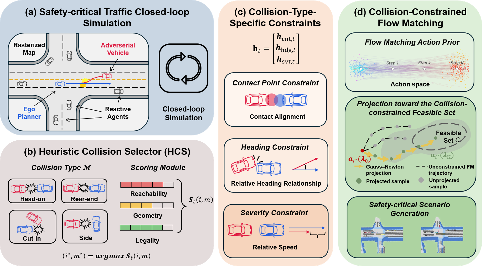

<div align="center">

# CCFM: Collision-Constrained Flow Matching for Safety-Critical Scenario Generation

**[Ke Li](https://kelisbu.github.io/)<sup>1</sup>, [Kaidi Liang](https://liangkd.github.io/)<sup>1</sup>, Yuxin Ding<sup>2</sup>, [Debojyoti Biswas](https://bishalnstu.github.io/)<sup>2</sup>[Xianbiao Hu](https://sites.psu.edu/xbhu/xb-hu/)<sup>2</sup>, [Ruwen Qin](https://sites.google.com/stonybrook.edu/rqin/home)<sup>1</sup>\***

<sup>1</sup> Department of Civil Engineering, Stony Brook University
<sup>2</sup> Department of Civil Engineering, Pennsylvania State University

[](https://arxiv.org/abs/XXXX.XXXXX)
[](https://huggingface.co/Ke66668888/HMPDM-Cityscapes)
[](#license)

<h2 align="center">🎉 Accepted by ECCV 2026 🎉</h3>
</div>

<div align="center">
  
</div>

- **CCFM** — *Collision-Constrained flow matching*. At sampling time the adversarial
  agent's trajectory is projected onto a set of hard collision constraints
  (contact `cnt`, heading `hdg`, severity `svt`), enabled with
  `--ccfm`.
- **HCS** — *Heuristic Collision Selector*. Picks **which** agent becomes the
  adversary and **which** collision type to target, and re-selects it
  periodically during the rollout (`--hcs_mode`, `--hcs_freq`).


---

## 1. Environment Setup

```bash
# Conda environment
conda create -n ccfm python=3.8
conda activate ccfm

# Install this repo
git clone https://github.com/KELISBU/CCFM
cd CCFM
pip install -e .

# Install the modified trajdata
cd ..
git clone https://github.com/KELISBU/trajdata
cd trajdata
pip install -e .
```

You may need to install PyTorch manually to match your CUDA setup:
<https://pytorch.org/get-started/>. A full pinned environment is also provided in
[`environment.yml`](environment.yml) (`conda env create -f environment.yml`).

---

## 2. Data Preparation

CCFM is evaluated on the **nuScenes** dataset, processed through **trajdata**.

1. **Download** nuScenes following the
   [nuScenes devkit setup guide](https://github.com/nutonomy/nuscenes-devkit#nuscenes-setup).

2. **Organize** the dataset:

   ```
   /path/to/nuScenes/
   ├── maps/
   ├── samples/
   ├── sweeps/
   ├── v1.0-mini/
   ├── v1.0-test/
   └── v1.0-trainval/
   ```

3. **Preprocess / cache** the data and maps with trajdata:

   ```bash
   cd trajdata
   python examples/preprocess_data.py
   ```

---

## Configuration: Paths to Fill In

This repo ships with `path/to/...` **placeholders** instead of machine-specific
paths. Replace them before training or running the simulation:

| Where | Field(s) | Set to |
| --- | --- | --- |
| `evaluation/CCFM.yaml` | `planner.ckpt_dir`, `predictor.ckpt_dir` | your FM agent + unicycle-predictor checkpoint dirs |
| `train.sh` | `DATASET`, `OUTPUT_DIR` | nuScenes (trajdata) path, training output dir |
| `nuscene_simulation.sh` / `nuplan_simulation.sh` | `DATASET`, `OUTPUT_ROOT` | dataset path, results output dir |
| `tbsim/evaluation/env_builders.py` | `real_histogram_file` | GT histogram `hist_stats.json` (realism-deviation metric) |

---

## 3. Training

Train the flow-matching agent model (config `nusc_flowmatching`, registered in
[`tbsim/configs/registry.py`](tbsim/configs/registry.py)):

```bash
bash train.sh
```

`train.sh` runs:

```bash
python scripts/train.py \
  --config_name nusc_flowmatching \
  --dataset_path /path/to/nuScenes \
  --output_dir /path/to/outputs \
  --name ccfm_flowmatching
```

Checkpoints, TensorBoard logs, and visualizations are written under
`--output_dir`. Point `evaluation/CCFM.yaml` at the resulting checkpoint before
running the simulation.

---

## 4. Running the Simulation
Pre-trained checkpoints on nuScene are released on the HuggingFace Hub:[Ke66668888/CCFM](https://huggingface.co/Ke66668888/CCFM/tree/main)

> **Before running the simulation**, generate the ground-truth trajectory
> statistics used by the realism-deviation metric (two steps):
> ```bash
> # Step 1: run a GroundTruth rollout to produce the GT h5 (data.hdf5)
> python scripts/run_adv_simulation.py \
>   --eval_class=GroundTruth \
>   --env=nusc --dataset_path=/path/to/nuscenes \
>   --results_root_dir=path/to/results/GT_baseline \
>   --scene_select_mode=collision_all --sim-steps=200
>
> # Step 2: compute hist_stats.json from that h5 (written next to the h5)
> python scripts/calculate_real_histogram.py \
>   --h5_path path/to/results/GT_baseline/data.hdf5 --mode tbsim
> ```
> Then point `real_histogram_file` (in `tbsim/evaluation/env_builders.py`) at the
> resulting `hist_stats.json`.

The CCFM safety-critical simulation is launched with:

```bash
bash nuscene_simulation.sh
```

which runs two horizons (80 and 200). The core command is:

```bash
python scripts/run_adv_simulation.py \
  --results_root_dir=/path/to/results/CCFM_80 \
  --dataset_path=/path/to/nuscenes \
  --env=nusc \
  --eval_class=StrivePolicy_trajdata \
  --agent_eval_class=CCFM \
  --ckpt_yaml=evaluation/CCFM.yaml \
  --render --scene_select_mode=collision_all \
  --ccfm --hcs_mode=periodic --hcs_freq=5 \
  --split_dataset
# For a 200 horizon, add: --sim-steps=200 delete: --split_dataset
```

### Key Arguments

| Argument | Description |
| --- | --- |
| `--results_root_dir` | Directory to store simulation results |
| `--dataset_path` | Path to the nuScenes (trajdata) cache |
| `--env` | Dataset environment (`nusc`) |
| `--eval_class` | Ego planner under test (e.g. `StrivePolicy_trajdata`) |
| `--agent_eval_class` | Reactive agent model — `FM` (flow matching for the unconstrained baseline) |
| `--ckpt_yaml` | Checkpoint config (`evaluation/CCFM.yaml`) |
| `--scene_select_mode` | Scene subset to evaluate (e.g. `collision_all`) |
| `--sim-steps` | Simulation length in steps (default `100`; use `200` for the 200 step run) |
| `--split_dataset` | Split scenes into 80 step windows |
| **`--ccfm`** | **Enable CCFM constrained guidance (constraint projection)** |
| **`--hcs_mode`** | **HCS event-selection mode: `once` (at reset) or `periodic`** |
| **`--hcs_freq`** | **HCS re-selection frequency (steps) when `--hcs_mode=periodic`** |


### Visualization

```bash
python scripts/visualize.py \
  --output_dir=$OUTPUT_PATH --dataset_path=$DATA_PATH --env=nusc --hdf5_path=$HDF5_PATH
```

---

## License & Attribution

This work is licensed under the Creative Commons Attribution-NonCommercial 4.0
International License (CC BY-NC 4.0).

This repository includes components derived from
[NVIDIA's Traffic Behavior Simulation repository](https://github.com/NVlabs/traffic-behavior-simulation),
licensed under the
[NVIDIA Source Code License - NC](https://github.com/NVlabs/traffic-behavior-simulation/blob/main/LICENSE).
Any use must comply with **both** licenses, including the non-commercial
restriction.

## Citation
## Acknowledgement
This repository builds on
[traffic-behavior-simulation (tbsim)](https://github.com/NVlabs/traffic-behavior-simulation),
which uses [trajdata](https://github.com/NVlabs/trajdata) for data handling, and
extends the [SAFE-SIM](https://arxiv.org/abs/2401.00391) framework.
